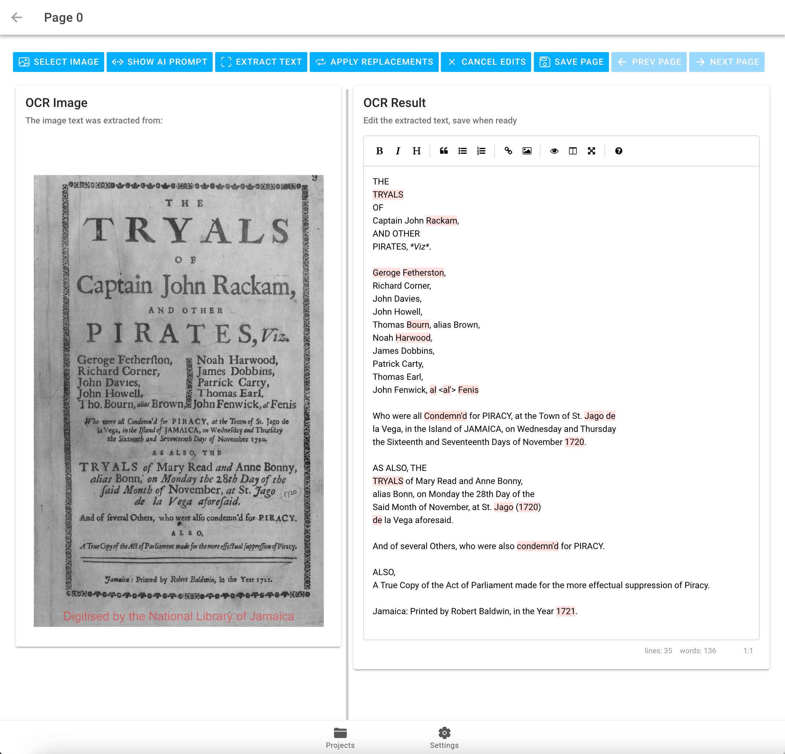

# OCR workbench

OCR Workbench is an environment for OCRing documents and producing a transcription, in either Markdown or HTML format. Since even AI-generated OCR of old documents frequently requires
significant editing, OCR Workbench includes tools to edit the raw OCR'd text.

It was inspired by this [HackerNews post](https://news.ycombinator.com/item?id=43048698&utm_source=hackernewsletter&utm_medium=email&utm_term=ask_hn), and my own difficulties using off-the-shelf OCR to transcribe Colonial American documents, which have some unique challenges. 

OCR workbench uses AI-based OCR, in particular it is connected to Gemini, or a switchable fallback that uses Tesseract. Tesseract is free, but performs poorly on these kinds of documents. As of this writing, Gemini is also free, at least for limited usage.

Gemini (and Claude, in the few experiments I did) performs notably better than Tesseract or traditional OCR. Gemini and Claude both require API keys, which are not included in this repo; you'll have to get your own. As of this moment the Gemini API key seems to be free, but that may not last and YMMV. 

OCR Workbench is an Ionic/Angular client.

For the curious, it was largely "vibe-coded" with Claude.ai. I asked for an Ionic app with the desired features, and then refined/added features using Cursor / Claude. I have done some hand-styling, and feature tweaks, but probably 80% of the project is AI generated, as is the (rather crude) icon. :)



A live demo is currently running here, BYO API Key: [https://ocr-workbench.web.app/](https://ocr-workbench.web.app/) 

## Basic workflow

1. Download a PDF you wish to transcribe (the repo includes some samples in the ```tests``` directory.)
2. Split the PDFs into one page per file. (see below)
3. Create a project, and select the directory where the image files are. Then you may transcribe, page-by-page.
4. On each page, 'extract text' will run your selected OCR engine on the page. Save the text if you want to keep it. 


## To get images from PDFs (e.g. PDFs from archive.org)

Download the pdf, then, 

```magick -density 300 yourfile.pdf -quality 85 output-%03d.jpg```

Choose the quality parameters that suit you. All the pages will be loaded into browser memory, so lots of pages that are very large images will drag you down :)

I have found that quality=85 is more than sufficient for OCRing even grainy images.

## Features

- Once OCR'd, the text for a given page will be placed in a Markdown editor gui, where it can be further tweaked. If you want to keep your changes, hit 'Save'. (I used [EasyMDE](https://github.com/Ionaru/easy-markdown-editor), which is very nice.)
- At the project level, you can define substitutions:  the interface calls them *replacements*. Very helpful if you want to globally fix a common spelling error, or "markdown-ize" frequently italized words which the OCR does not detect.
  - Replacements can be a regex, though I have not tested this extensively.
* Adjustable viewing panel: the Image is placed side-by-side with the OCR'd text, for comparison and editing. There is a vertical slider to adjust the relative sizes of the two documents.
* De-hyphenization. AI transcription will usually preserve any hyphens that come from word splits across lines. The DeHyphen button will remove those splits. 
* Find/Replace: Does a Find/Replace on the current page only.
* Export: You can export your project to markdown or html, and you can choose one file per page, or one global file. 
* Prompts: If you are using an AI-driven OCR, you can alter the default prompt if you like. 
* OCR engine selection: can be made from the Settings tab.

Note that Tesseract is free, but frequently does not work well on old (e.g. 18th century documents, or Archive.org page scans). You can control which OCR engine is used on the Settings tab.

## API KEYS

OCR Workbench reads API keys (for example, your Gemini API key) from the environment file (src/environments/environment.ts).

After you have a local install of this repo, do the following:
 
```
cp .env.example .env
```

Then edit .env to add your keys. Then run this command:

```
bash installkeys.bash
```

This will insert the keys in the .env file into the environment file. 

`.gitignore` ignores the .env file, so that file will not be uploaded should you commit to git, to avoid publishing your API keys to git. 

Alternatively, you can set your Gemini API key on the Settings page. The key will be persisted in local storage, and used for Gemini calls, and no other purpose.

To obtain a Gemini key, go here: [https://ai.google.dev/gemini-api/docs/api-key](https://ai.google.dev/gemini-api/docs/api-key).

## Gemini Quirks

On some older documents, Gemini may issue a "RECITATION" error, indicating it thinks the data is part of its training materials, or under copyright. It can do this in error, as with our test data. There is an issue filed about it somewhere :)

## Data Storage

The app implements two different storage strategies: the data may be stored in the Browser using [RxDB](https://rxdb.info/), or (hypothetically) in the cloud via Firebase. Claude generated the Firebase storage implementation but it is completely untested (and would require an authentication setup as well). The existing repo uses RxDB, so your database is stored in the browser.

Note that therefore your data is tied to your url, so if, for example, you switch the port the app is running on, your data will appear to have disappeared. This can happen if (for example) you are running two different 'ionic serve' commands at the same time. Just get on the right port and your data will re-appear.

## Install

1. Ensure you have ionic installed.
2. Clone the repo.
3. `ionic serve`

## Test data

The repo includes a copy of the US Constitution, and the [Trial of John Rackham](https://discovery.nationalarchives.gov.uk/details/r/C14075679) (the notorious pirate popularized in the TV series *Black Sails*). Both documents are in the public domain.

## Todos (in no particular order):

implement Claude-based OCR. 

allow selection of a region for OCR (for images with more than one column, e.g. )

ability to insert forced page breaks, and / or not manually include page breaks in the markdown merged output

ability to make special commands into the editor, e.g. a Center command that inserts e.g.
::::: {.centered}
::::: 
around a region

Implement Firebase.

## License

MIT License. Have at it. PR's welcome.


